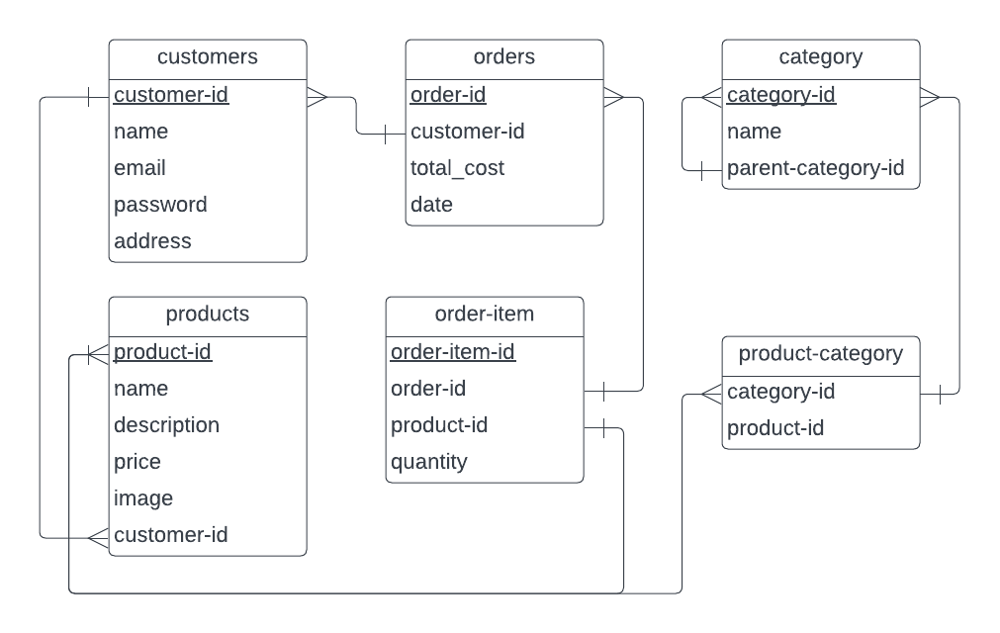

# E-Commerce API

### A Simple Market-Place like API implemented using FastAPI

## Database Design



## TODOS

- [ ] Implement Tests In `/tests`

## To Run this Project Locally

### 1.Clone This Repository

```sh
git clone https://github.com/shonnoronha/ecommerce-backend.git
cd ecommerce-backend
touch .env
```

### 2.Configuring The Project

- Setup a Postgres Database locally and enter credentials into .env file
- Secret Key can be generated by running the following command in your terminal `openssl rand -hex 32`
- Algorithm can either be `HS256` or `RS256` (recommended:`HS256`)
- The Expiry Time of JWT can also be configured (defaults to 60 minutes)

Options for .env file (all are required)

```py
DATABASE_HOSTNAME=
DATABASE_PORT=
DATABASE_PASSWORD=
DATABASE_NAME=
DATABASE_USERNAME=
SECRET_KEY=
ALGORITHM=
ACCESS_TOKEN_EXPIRE_MINUTES=
ADMIN_EMAIL=
```

### 3.Starting the Project

- Docker(Recommended)

```sh
docker-compose up -d
docker exec ecommerce alembic upgrade head
```

### OR

- Install manually

```sh
pip install -r requirements.txt
alembic upgrade head
uvicorn app.main:app
```

### 3. Open Docs

- Visit [localhost:8000/docs](http://localhost:8000/docs)
- Create a Customer with Admin Email
- Login using Admin Email
